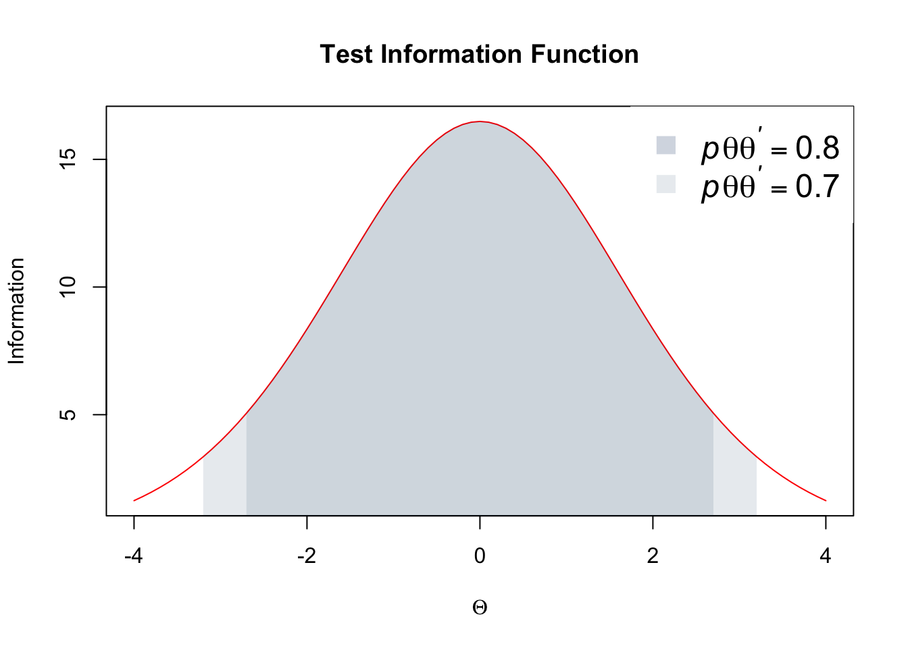
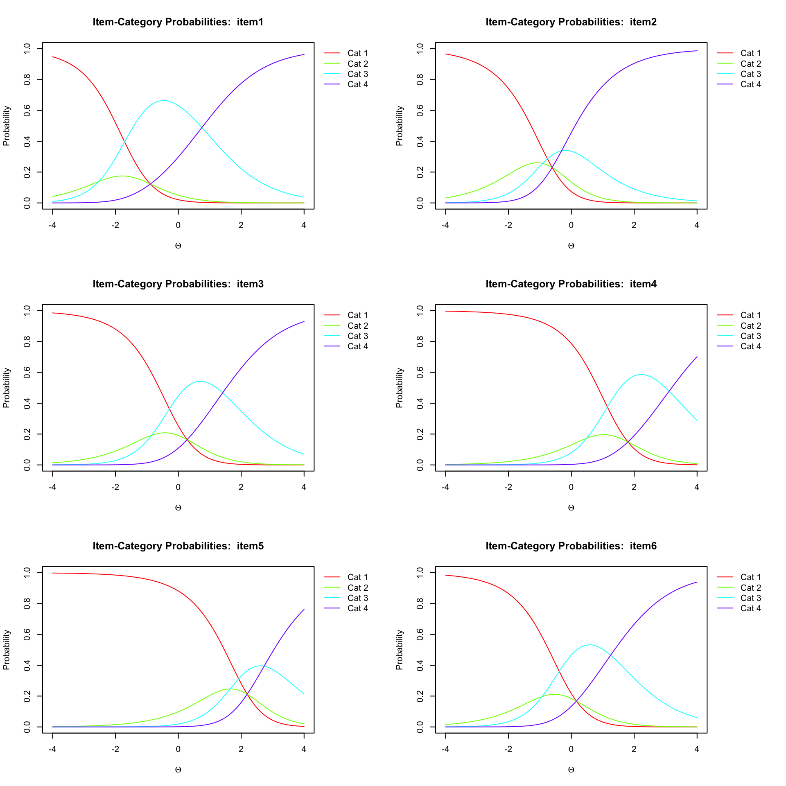
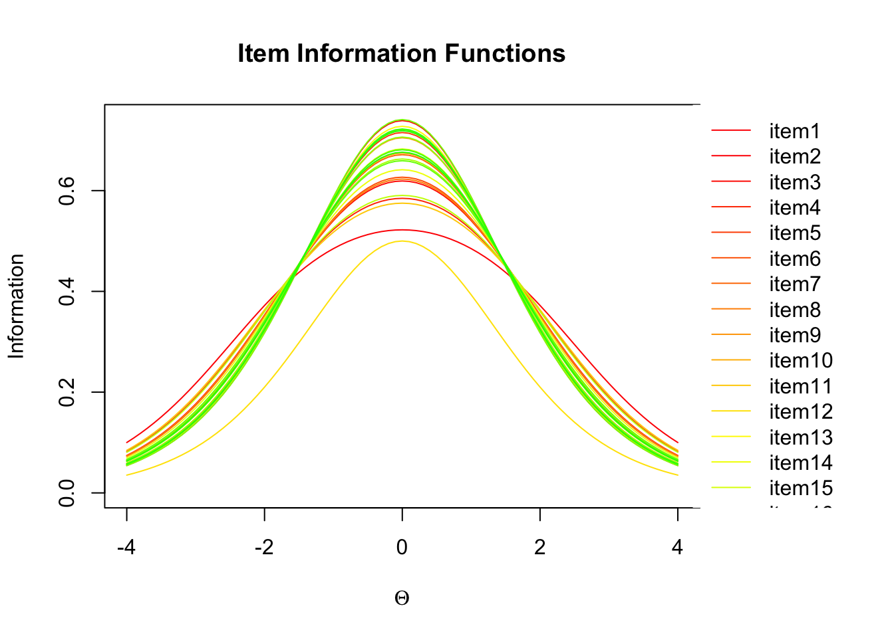
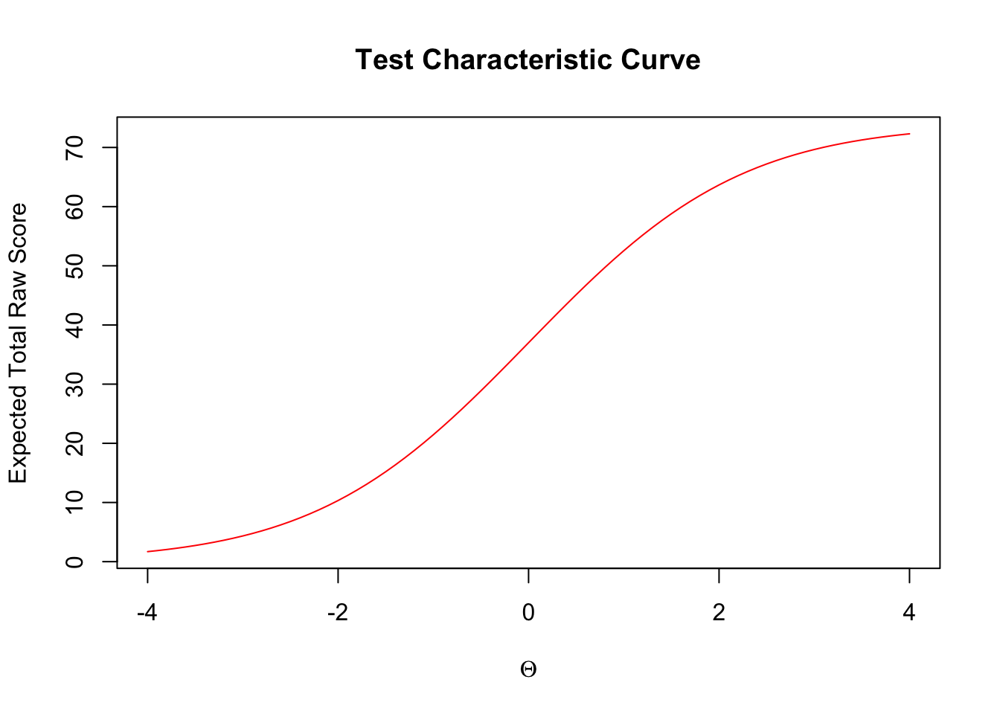
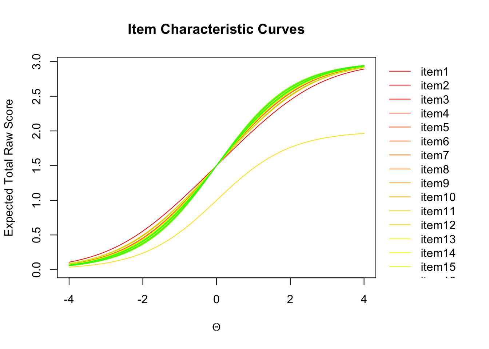
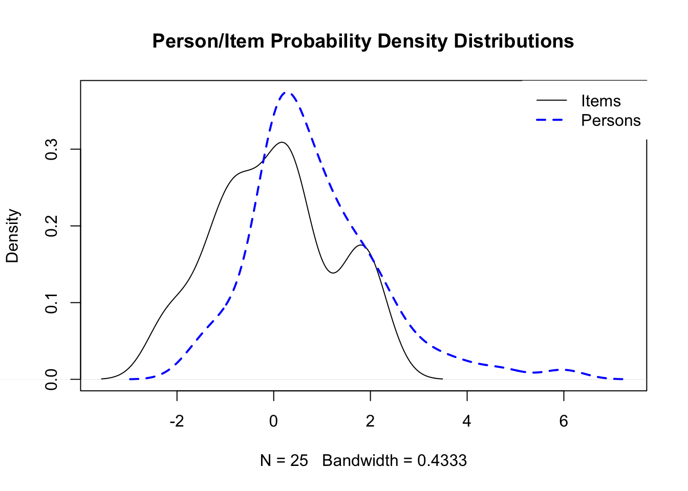
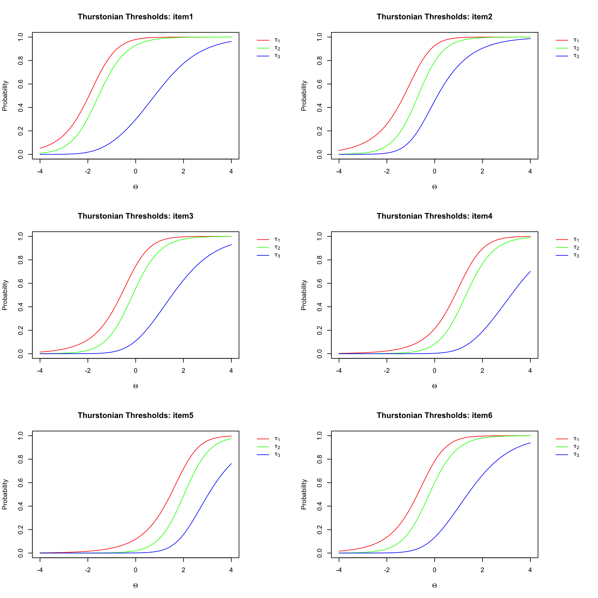

# Overview
The *r2Winsteps* package was developed to provide a convenient interface
  between *R* and the Rasch modeling software *Winsteps*
  (http://www.winsteps.com). The package is not intended to encompass the full
  capabilities of *Winsteps*, but rather to provide a simple framework for
  estimating many commonly applied models. There are also a few extensions to
  *Winsteps* that are used within R.

The primary features of the package include the ability to:

* Write control and data files for Winsteps with the `r2Winsteps()` function,
  which includes automatic detection of polytomous item types. Either the
  rating scale or partial credit models can be estimated.
* Run Winsteps directly from R with the `runWinsteps()` function, which writes
  and executes a `.bat` file to call *Winsteps*. Item, person, and structure
  (if a polytmous model is estimated) parameters are returned in a list.
  Intermediary files (control, data, output, etc.) can be stored or discarded
  (default).
* Batch run a set of models with the `batchRunWinsteps()` files. Essentially
  calls `runWinsteps()`, but takes as its argument a list of
  data frames, with a different model fit and parameter estimates returned for
  each data frame in the list. At present, `batchRunWinsteps()` only works for
  dichotomous items. 
* Both `runWinsteps()` and `batchRunWinsteps()` can include anchor files to
  anchor specific items at specific values. The function `write.anchor()` can also be used to help produce anchor files, given a previously estimated ifile and a new dataset to analyze.
* Numerous default plotting options, as well as fully user-manipulable plot
  functionality.

For the primary motivations behind the development of the package, see the
  *overview* vignette. Note that the package is still in active development.
  Use at your own risk. If you find any bugs, please email them to
  daniela@uoregon.edu, or log them at
  https://github.com/DJAnderson07/r2Winsteps/issues.

## Installation


```r
library(devtools)
install_github("DJAnderson07/r2Winsteps")
```

### Citation info


```r
citation(package = "r2Winsteps")
```

```
## 
## To cite package 'r2Winsteps' in publications use:
## 
##   Daniel Anderson (2015). r2Winsteps: A package for interfacing
##   between R and the Rasch modeling software Winsteps. R package
##   version 0.0.0.9000. https://github.com/DJAnderson07/r2Winsteps
## 
## A BibTeX entry for LaTeX users is
## 
##   @Manual{,
##     title = {r2Winsteps: A package for interfacing between R and the Rasch modeling software
## Winsteps},
##     author = {Daniel Anderson},
##     year = {2015},
##     note = {R package version 0.0.0.9000},
##     url = {https://github.com/DJAnderson07/r2Winsteps},
##   }
```

# Basic usage
We will analyze the science data and look at a few plots.


```r
library(r2Winsteps)
data(science)
head(science)
```

```
##   item1 item2 item3 item4 item5 item6 item7 item8 item9 item10 item11
## 1     1     2     1     1     1     0     2     0     1      2      2
## 2     2     2     2     2     2     2     2     2     2      2      2
## 3     2     2     1     1     0     1     1     0     1      2      2
## 4     1     0     1     0     0     1     0     1     2      2      1
## 5     1     0     1     0     1     0     1     0     0      1      1
## 6     1     0     1     1     2     1     1     0     1      1      1
##   item12 item13 item14 item15 item16 item17 item18 item19 item20 item21
## 1      2      2      0      2      1      1      2      2      0      2
## 2      2      2      2      2      2      2      2      2      2      2
## 3      2      2      1      2      2      1      2      2      1      2
## 4      2      2      1      1      1      1      2      2      0      2
## 5      1      1      0      0      1      1      2      2      1      1
## 6      2      1      0      1      0      1      2      2      1      0
##   item22 item23 item24 item25 Sex LastName FirstName MiddleName
## 1      1      0      2      0   M  Rossner      Marc     Daniel
## 2      2      2      2      2   M  Rossner  Lawrence         F.
## 3      1      1      1      1   M  Rossner      Toby         G.
## 4      1      1      1      1   M  Rossner   Michael         T.
## 5      1      1      1      0   F  Rossner   Rebecca         A.
## 6      1      2      1      0   M  Rossner        Tr        Cat
```

Notice that these data are polytomous, which will be detected automatically.
Andrich's Rating Scale model will be fit by default, but we can also fit
Masters' Partial Credit Model, as shown below. To fit the model, we split the
dataset into person demographics, and item responses, then call `runWinsteps()`


```r
# Split data
itemsSci <- science[ ,1:25]
demosSci <- science[ ,26:ncol(science)]

# Run model 
parsSci <- runWinsteps(itms = itemsSci, dems = demosSci, partialCredit = TRUE)
```
All the parameters have been estimated with *Winsteps*, and have been read back into R, including the partial credit structure file.


```r
str(parsSci)
```

```
## List of 3
##  $ ItemParameters  :'data.frame':	25 obs. of  22 variables:
##   ..$ Entry               : int [1:25] 1 2 3 4 5 6 7 8 9 10 ...
##   ..$ Difficulty          : num [1:25] -0.89 -0.61 0.28 1.8 2.19 0.16 0.99 1.64 0.6 -1.57 ...
##   ..$ Status              : int [1:25] 1 1 1 1 1 1 1 1 1 1 ...
##   ..$ Count               : num [1:25] 75 75 75 75 75 75 75 75 75 75 ...
##   ..$ RawScore            : num [1:25] 109 116 88 52 37 91 69 54 80 130 ...
##   ..$ SE                  : num [1:25] 0.23 0.2 0.2 0.21 0.22 0.2 0.19 0.21 0.18 0.26 ...
##   ..$ Infit               : num [1:25] 0.73 0.75 0.66 0.99 2.28 0.88 0.97 1.17 1.11 0.78 ...
##   ..$ Infit_Z             : num [1:25] -1.93 -1.49 -2.63 -0.03 5.28 -0.79 -0.17 1.14 0.83 -1.09 ...
##   ..$ Outfit              : num [1:25] 0.67 0.56 0.62 0.98 3.98 0.82 1 1.23 1.13 0.56 ...
##   ..$ Outfit_Z            : num [1:25] -1.83 -1.44 -2.51 -0.05 6.98 -1.01 0.08 1.41 0.76 -1.14 ...
##   ..$ Displacement        : num [1:25] 0 0 0 0 0 0 0 0 0 0 ...
##   ..$ PointMeasureCorr    : num [1:25] 0.64 0.58 0.72 0.6 0.05 0.61 0.59 0.51 0.53 0.5 ...
##   ..$ Weight              : num [1:25] 1 1 1 1 1 1 1 1 1 1 ...
##   ..$ ObservMatch         : num [1:25] 74.3 73 74.3 71.6 52.7 68.9 52.7 45.9 56.8 78.4 ...
##   ..$ ExpectMatch         : num [1:25] 66.5 62.5 60.4 61.5 68.7 60.3 55.2 60.2 54.5 77 ...
##   ..$ PointMeasureExpected: num [1:25] 0.48 0.46 0.55 0.59 0.63 0.54 0.59 0.6 0.57 0.38 ...
##   ..$ RMSR                : num [1:25] 0.43 0.5 0.47 0.54 0.81 0.55 0.6 0.61 0.67 0.4 ...
##   ..$ WMLE                : num [1:25] -0.89 -0.6 0.28 1.8 2.18 0.17 0.99 1.64 0.6 -1.55 ...
##   ..$ Group               : int [1:25] 0 0 0 0 0 0 0 0 0 0 ...
##   ..$ Model               : Factor w/ 1 level " R": 1 1 1 1 1 1 1 1 1 1 ...
##   ..$ Recoding            : Factor w/ 1 level " .": 1 1 1 1 1 1 1 1 1 1 ...
##   ..$ ItemID              : Factor w/ 25 levels " item1"," item10",..: 1 12 19 20 21 22 23 24 25 2 ...
##  $ PersonParameters:'data.frame':	75 obs. of  22 variables:
##   ..$ Entry               : int [1:75] 1 2 3 4 5 6 7 8 9 10 ...
##   ..$ Theta               : num [1:75] 0.49 5.98 0.99 0.14 -0.77 -0.2 2.63 0.86 -0.2 0.26 ...
##   ..$ Status              : int [1:75] 1 0 1 1 1 1 1 1 1 1 ...
##   ..$ Count               : num [1:75] 25 25 25 25 25 25 25 25 25 25 ...
##   ..$ RawScore            : num [1:75] 30 50 34 27 19 24 44 33 24 28 ...
##   ..$ SE                  : num [1:75] 0.35 1.84 0.36 0.34 0.34 0.34 0.48 0.36 0.34 0.34 ...
##   ..$ Infit               : num [1:75] 0.96 1 0.46 0.73 0.81 1.61 1.85 1.01 1.42 0.74 ...
##   ..$ Infit_Z             : num [1:75] -0.07 0 -2.29 -1.04 -0.71 2.08 1.93 0.13 1.54 -0.98 ...
##   ..$ Outfit              : num [1:75] 0.84 1 0.42 0.66 1.4 2.51 1.18 0.85 2.01 0.66 ...
##   ..$ Outfit_Z            : num [1:75] -0.31 0 -1.44 -1 1.2 3.44 0.5 -0.21 2.53 -0.95 ...
##   ..$ Displacement        : num [1:75] 0 0 0 0 0 0 0 0 0 0 ...
##   ..$ PointMeasureCorr    : num [1:75] 0 0 0 0 0 0 0 0 0 0 ...
##   ..$ Weight              : num [1:75] 1 1 1 1 1 1 1 1 1 1 ...
##   ..$ ObservMatch         : num [1:75] 68 100 88 76 64 56 76 64 52 64 ...
##   ..$ ExpectMatch         : num [1:75] 61.7 100 63.4 59.9 60 59.1 79.3 63.9 59.1 61 ...
##   ..$ PointMeasureExpected: num [1:75] 0 0 0 0 0 0 0 0 0 0 ...
##   ..$ RMSR                : num [1:75] 0.56 0 0.38 0.5 0.53 0.75 0.57 0.56 0.71 0.5 ...
##   ..$ WMLE                : num [1:75] 0.48 5.98 0.98 0.14 -0.77 -0.2 2.57 0.85 -0.2 0.25 ...
##   ..$ Sex                 : Factor w/ 2 levels " F "," M ": 2 2 2 2 1 2 2 2 2 2 ...
##   ..$ LastName            : Factor w/ 62 levels " Airehead   ",..: 48 48 48 48 48 48 62 31 53 27 ...
##   ..$ FirstName           : Factor w/ 66 levels " Alan       ",..: 36 33 61 39 49 63 7 53 38 17 ...
##   ..$ MiddleName          : Factor w/ 19 levels ""," A."," Baby",..: 5 7 9 18 2 4 1 19 1 16 ...
##  $ StructureFiles  :'data.frame':	74 obs. of  3 variables:
##   ..$ Item    : int [1:74] 1 1 1 2 2 2 3 3 3 4 ...
##   ..$ Category: int [1:74] 0 1 2 0 1 2 0 1 2 0 ...
##   ..$ delta   : num [1:74] 0 -1.64 1.64 0 -0.3 0.3 0 -1.13 1.13 0 ...
##  - attr(*, "class")= chr "r2Winsteps"
```

## Test information function

We can view the test information function by just calling `plot` on the object


```r
plot(parsSci)
```



Notice that the regions where reliability is 0.8 and 0.7 are shaded by default.

## Item category probabilities

Next let's look at the item category probabilities for the first six items.


```r
par(mfrow = c(3, 2))
plot(parsSci, type = "ICP", itemSelect = 1:6)
```



Let's view some more plots

## Item information function

```r
plot(parsSci, type = "IIFs")
```



## Test characteristic curve

```r
plot(parsSci, type = "TCC")
```



## Item characteristic curves

```r
plot(parsSci, type = "ICCs")
```



## Item-Person density

```r
plot(parsSci, type = "ipDens")
```



## Thresholds: First 6 items

```r
par(mfrow = c(3, 2))
plot(parsSci, type = "thresholds", itemSelect = 1:6)
```



There are also other plots and batch processing capabilities. The software is under active development and is released "as is". For more complete documentation see the vignettes or contact the author.
