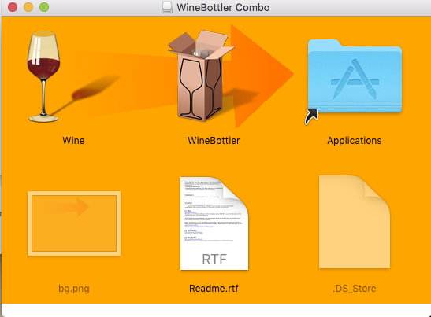
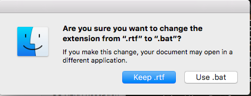
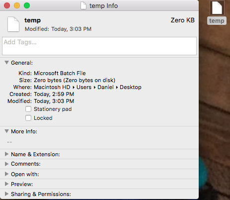
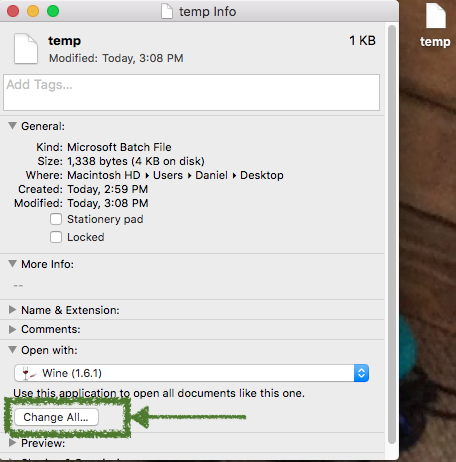

Winsteps is exclusively designed for Windows, and if you are on a Windows machine you should be good to go from here. However, if you'd like to use a Mac, you can do so through *Wine* (see https://www.winehq.org), a free, open-source "compatibility layer" for running windows programs on OS X. There are several approaches you can take here. Below, I walk you through what I have found the most successful. First, download and install *Wine Bottler*, which is also free: http://winebottler.kronenberg.org (be careful not to accidentally download any of the other pop-up software). You'll then need to double click the .dmg file, which will prompt you to drag two apps, *Wine* and *Wine Bottler*, into  your application folder, as shown below.



# Step 1: Install Wine and Winsteps
## Method 1: Install *Winsteps* with *Wine Bottler*
At this point, you can try to use *Wine Bottler* to install *Winsteps* (launch *Wine Bottler*, click on *Advanced*, then *Select File*, navigate to the Winsteps installer (.exe), then click *Open*, then *Install*. Save as *Winsteps*). You will then be taken through the Winsteps installation process, just as you would if you were on a Windows machine (note, you will need your password here). If this works (Winsteps should launch, if so), you're in great shape. If not, continue on, but regardless, you will want the *Wine* app that comes with *Wine Bottler*. 

## Method 2: Install with *Homebrew*
If you get hit with one or more errors when installing with Wine Bottler (i.e., Winsteps does not launch after installation), I suggest instead installing wine directly with homebrew, as outlined here: http://www.davidbaumgold.com/tutorials/wine-mac/. When you run `brew install wine`, make sure you do not get any errors. If you do, run `brew doctor` and cut and paste the code it suggests. At this point, you should have *Wine* installed. The last step is to install Winsteps. To do this, first locate the executable installer file (.exe). Then type `wine`, followed by a space, and then drag the executable into terminal. This should copy the path to the executable. For example, it may looks something like the below

```
wine /Applications/v3.91/WinstepsPasswordInstall3910.exe
```
You will then be taken through the Winsteps installation process, just as you would if you were on a Windows machine (note, you will need your password here). If you're still having issues, look closely again at `brew doctor`. If you can't find the answer there, google is your friend.

# Step 2: Force .bat files to open with *Wine*
The real reason for installing *Wine Bottler* (outside of potentially making Winsteps installation easier), is because the app also provides an icon to link to *Wine*, just like any other app. This is helpful because we need to force all .bat files to open with *Wine* by default, and once we have the icon this is really simple. 

First, open a text editor and save an empty file as *temp.bat*. Note if you use TextEdit, it won't allow you to save .bat files and will require the file be saved as *temp.bat.rtf* or something similar. That's fine. Just save the file, and then manually change the extension after it is already saved. This will prompt Finder to make sure you want to change the extension, as shown below. Go ahead and change it to .bat. Alternatively, if you have a more advanced text editor like *Sublime Text* or *Text Wrangler*, you should be able to save a .bat file directly.



Once you have your *temp.bat* file, then select it by clicking on it once (but don't open it), and hit command + i. This should open the dialogue box below. 



Finally, click the *Open with:* tab. If *Wine* is not already the default program, select it from the applications (you may have to click *other* and select *Wine* from there). Finally, press *Change All...*. Mac will again ask you if you are sure you want to make this change. Select *Continue* and you should be all set! You're now ready to go with *r2Winsteps* on a Mac.


