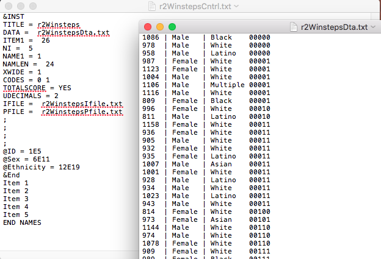
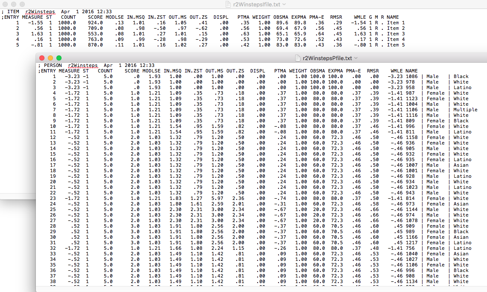

```{r, setup, include = FALSE}

library(knitr)

# Set number printing formats
knit_hooks$set(inline = function(x) {
  prettyNum(x, big.mark=",")
})

opts_chunk$set(cache = TRUE, cache.comments = FALSE, autodep = TRUE)
dep_auto()
```


\centering
\raggedright
\newpage
\tableofcontents

# Introduction
The *r2Winsteps* package was developed to provide a convenient interface
  between *R* [@R] and the Rasch modeling software *Winsteps* [@Linacre]. The
  package is not intended to encompass the full capabilities of *Winsteps*, but
  rather to provide a simple framework for estimating many commonly applied
  models. The primary features of the package include:

* Write control and data files for Winsteps with the `r2Winsteps()` function,
  which includes automatic detection of polytomous item types. Either the
  rating scale [default; @Andrich] or partial credit models [@Masters] can be
  estimated.
* Run Winsteps directly from R with the `runWinsteps()` function, which writes
  and executes a `.bat` file to call *Winsteps*. Item, person, and structure
  (if a polytmous model is estimated) parameters are returned in a list.
  Intermediary files (control, data, output, etc.) can be stored or discarded
  (default).
* Batch run a set of models with the `batchRunWinsteps()` files. Essentially
  calls `runWinsteps()`, but takes as its argument a list of
  data frames, with a different model fit and parameter estimates returned for
  each data frame in the list.

There were three primary motivation for developing *r2Winsteps*. First, 
  *Winsteps* is a powerful software that can fit a range of Rasch models with impressive speed. By linking the software to *R*, a unified framework is provided where users can prep, explore, and analyze their data within the same environment. This is important not only for convenience and efficiency purposes, but also to facilitate transparency. When multiple software packages are used, and multiple script files stored, it can be easy for an outside researcher (or indeed, the same researcher at a later time) to get lost in the process used. This is also an important principle of reproducible research [@Stodden], and can facilitate dynamic document generation [@Xie] with Winsteps, where all tables and figures are generated in a report are generated dynamically. That is, as the model or data are updated, so too are the features within the document that depend on them. This document is an example of using *Winsteps* within *R* to generate a reproducible and dynamic document, via the *r2Winsteps* package (although in practice, most documents would include the code being hidden).

The second primary motivation for developing *r2Winsteps* was the powerful
  plotting capabilities in *R*, coupled with tremendous flexibility. *Winsteps*
  provides many excellent plots, available through the graphs menu, but they
  are limited in that the user has little control over their appearance (e.g.,
  line types, colors, etc.). By contrast, *R* provides almost limitless
  flexibility, and multiple packages are available for facilitating plot
  creation (e.g., ggplot2 [@Hadley], lattice [@Sarkar]). The built-in plotting
  function in the *r2Winsteps* package are still under active development.
  These were all created with the base graphics, and should be fully
  customizable.

The third and final primary motivation for developing *r2Winsteps* was to develop an efficient method for batch processing analyses with *Winsteps*. While a batch processing option is available through *Winsteps*, one still must write each control and data file for each analysis. The *r2Winsteps* package allows for an efficient means of batch writing control and data files for analysis, which can then be estimated through *Winsteps* batch mode.

Note that the package is still in active development, and this vignette will be
  updated over time accordingly. The purpose of this vignette is to provide a
  few illustrated examples of using the package in its current stage. If you use the package, please reference it using the code below. If you find any bugs, please email them to daniela@uoregon.edu, or log them at https://github.com/DJAnderson07/r2Winsteps/issues.

```{r, reference}
citation(package = "r2Winsteps")
```

## Installation
For the time being, the *r2Winsteps* package is housed exclusively on *github*.
  Installation is straightforward via the *devtools* package. If you don't have
  *devtools* installed, you will need to first run the following:

```{r, devtoolsInstall, eval = FALSE}
install.packages("devtools")
```

Then, you just need to load the *devtools* package and install *r2Winsteps* directly from github.

```{r, install, eval = FALSE}
library(devtools)
install_github("DJAnderson07/r2Winsteps")
```

The package also (obviously) requires a working installation of *Winsteps*,
which is designed for Windows. If you are on a Windows machine, you should be
good to go from here. However, if you'd like to use a Mac, you can do so
through *Wine* (see https://www.winehq.org), a free, open- source
"compatibility layer" for running Windows programs on OS X. For help getting
Winsteps installed with *Wine*, see the documentation on *Using Wine with
Winsteps and the r2Winsteps Package on Macs*.

**One last Note:** Older versions of Winsteps included different (less) output
from the item and person files. The *r2Winsteps* package was built with
*Winsteps* Version 3.90. If you have an earlier version of Winsteps, there are
workarounds you can use in the options of the `read.pfile()` and `read.ifile()`
functions, and you may want to consider modifying the source code for your
particular installation.

# Using the package: Example 1, LSAT data
Now that everything is installed, let's start with a simple example. We'll
begin by fitting a Rasch model with dichotomous data, using the supplied LSAT
data.

```{r, loadData}
library(r2Winsteps)
data(LSAT)
head(LSAT)
```

It's generally a good idea to inspect some preliminary data, so we can get an
idea of what to expect from the model, and whether the assumptions of the model
appear tenable. First, we'll estimate the proportion of examinees responding
correctly to the items. Because the items are dichotomous, this is just the
mean.

```{r, pValues}
apply(LSAT[ ,4:8], 2, mean)
```

All items appear somewhat easy, but Item 1 is clearly the easiest while Item
3 is clearly the most difficult.

Next, we can compute the point-biserial correlation, by correlating the
response vector for each item with a vector of raw scores. We'll compute the
raw scores, and then compute the correlations.

```{r, ptBiserial}
raw <- rowSums(LSAT[ ,4:8])
round( sapply(LSAT[ ,4:8], function(i) cor(i, raw)), 2)
```

These are classical test theory indicators of *item discrimination*. The Rasch
model assumes essentially equivalent item discrimination (technically 1.0), and
so we're looking to see if any items appear wildly different from the others.
It's also worth noting that item-fit statistics reported by *Winsteps*, such as
the mean square outfit, are produced by evaluating the differences from
(essentially) the *average* biserial correlation [see @Wu]. These all appear
reasonable, so let's go ahead and fit the model. 

## Fitting the model
In this case, because the model and data are straightforward, we simply need to
call the `runWinsteps()` function, which requires the data be split into a data
frame of item responses and a data frame of person demographics.

```{r, LSAT_mod1}
# Split data
itemsLSAT <- LSAT[ ,4:8]
demosLSAT <- LSAT[ ,1:3]


# Run model 
parsLSAT <- runWinsteps(itemsLSAT, demosLSAT)
str(parsLSAT)
```

The function writes control and data files necessary to run a basic Rasch model
for the supplied data. Additionally, a *.bat* file is written to the same
directory, which is then executed to call *Winsteps* and run the analysis. By
default, the control file is written to have *Winsteps* write out the person
and item parameter estimates. These are then read back into R through other
functions in the package. Note that one of the things that's nice about this
approach, however, is that the person files are read back in with each
demographic variable separated into its own column, whereas the Winsteps files
contain all person identifying information in a single column.

## Plotting the fitted model
Generally, I like to explore plots of the fitted model before digging in too deep with the parameter estimates. Below, we'll go through some of the built-in plotting features. For example, we can view the test information function through

```{r, TIF}
plot(parsLSAT)
```

As mentioned in the introduction, this plot is easily modifiable. For example, we can remove the border and change the line color and type with the following code

```{r, TIFcustomized}
tif <- plot(parsLSAT, store = TRUE, bty = "n", col = "blue", lty = 2, lwd = 3)
```

Note that this time I have stored the plot in a new object, `tif`, and included the optional argument `store = TRUE`, which will return the test information values under the range of theta values requested. We can use these for a multitude of purposes, including further plotting. For example, if we wanted to shade the area under the curve corresponding to items from $-1$, to $1$, we could do so as follows 

```{r, TIFshadeNoEcho, echo = FALSE}
tif <- plot(parsLSAT, store = TRUE, bty = "n", col = "blue", lty = 2, lwd = 3)
theta <- seq(-4, 4, 0.1) # default x-axis

x1 <- theta[which(theta == -1)]
x2 <- theta[which(theta == 1)]

y <- tif[which(theta == -1):which(theta == 1)]

polygon(x = c(x1, seq(x1, x2, length.out = length(y)), x2), 
		y = c(0, y, 0),
		col = rgb(0, 0.2, 0.4, 0.2),
		border = FALSE)
```

```{r, TIFshade, eval = FALSE}
theta <- seq(-4, 4, 0.1) # default x-axis

x1 <- theta[which(theta == -1)]
x2 <- theta[which(theta == 1)]

y <- tif[which(theta == -1):which(theta == 1)]

polygon(x = c(x1, seq(x1, x2, length.out = length(y)), x2), 
		y = c(0, y, 0),
		col = rgb(0, 0.2, 0.4, 0.2),
		border = FALSE)
```

A more realistic situation may be shading the range in which the estimated reliability is above some threshold (e.g., 0.8). However, in this case, with only five items included in the analysis, the estimated reliability is low across the full ability range (with information peaking at a value $<$ 1.0). We could take the plot one step further and annotate it to describe the shaded region.

```{r, TIFexpressionNoEcho, echo = FALSE}
tif <- plot(parsLSAT, store = TRUE, bty = "n", col = "blue", lty = 2, lwd = 3)
theta <- seq(-4, 4, 0.1) # default x-axis

x1 <- theta[which(theta == -1)]
x2 <- theta[which(theta == 1)]

y <- tif[which(theta == -1):which(theta == 1)]

polygon(x = c(x1, seq(x1, x2, length.out = length(y)), x2), 
		y = c(0, y, 0),
		col = rgb(0, 0.2, 0.4, 0.2),
		border = FALSE)
text(0, 0.5, expression(Theta["{-1, 1}"]), cex = 2)
```

```{r, TIFexpression, eval = FALSE}
text(0, 0.5, expression(Theta["{-1, 1}"]), cex = 2)
```

This briefly illustrates some of the flexibility and power of plotting in *R*. We can also explore some of the other default plots by including the additional `type` argument to `plot`. For example, if we wanted to view each of the item information functions, we could do so as follows

```{r, IIFs1}
plot(parsLSAT, type = "IIFs")
```

We could alternatively only view a few (or one) item information function by including the additional `itemSelect` argument. For example, to see the curves for only items 1, 3, and 5, we could do so by passing the item locations or names to `itemSelect`

```{r, IIFs2, eval = FALSE}
plot(parsLSAT, type = "IIFs", itemSelect = c(1, 3, 5))
```

or equivalently

```{r, IIFs3, eval = FALSE}
plot(parsLSAT, type = "IIFs", itemSelect = c("Item 1", "Item 3", "Item 5"))
```

We could also pass the location of items to remove by including the `-` operator. The following is equivalent to the previous two code chunks producing the IIF plot for items 1, 3, and 5.

```{r, IIFs4}
plot(parsLSAT, type = "IIFs", itemSelect = -c(2, 4))
```

In some contexts, it may be helpful to view the test information function with the item information functions together, particularly if one wants to evaluate how the test information function may change with the exclusion of one or more items. This is possible through `type = "TIF/IIF"`. 

```{r, TIF_IIF1}
plot(parsLSAT, type = "TIF/IIF")
```

If we drop the two easiest items, 1 and 5, we can evaluate how the test information function changes.

```{r, TIF_IIFmin15}
plot(parsLSAT, type = "TIF/IIF", itemSelect = -c(1, 5))
```

Predictably, the distribution shifts toward the more difficult end of the scale.

Finally, item and test characteristic curves can also be helpful when evaluating tests, as they provide the expected raw score, given theta. The test characteristic is computed as

```{r, TCC}
plot(parsLSAT, type = "TCC")
```

It may be helpful to add some reference lines here. For example, what raw score corresponds with a theta estimate of 0 (or average)? To add this reference line, we may want to rerun the TCC with the optional `store = TRUE` to retain the expected raw scores.

```{r, TCCreference}
tcc <- plot(parsLSAT, type = "TCC", store = TRUE)

segments(x0 = 0, x1 = 0, 
			y0 = 0, y1 = tcc[which(theta == 0)], 
		col = "gray", lty = 2)

segments(x0 = -5, x1 = 0, 
			y0 = tcc[which(theta == 0)], y1 = tcc[which(theta == 0)],
		col = "gray", lty = 2)
```

In other words, examinees of average ability would be expected to score, on average, approximately 2.5 raw score points on the sample of 4 items on the LSAT.

The final built-in plot for dichotomous data that is currently available are the item-characteristic curves. Again, we can plot all, or just some of the items.

```{r, ICCs}
plot(parsLSAT, type = "ICCs")
```

The inflection point, or the point at which respondents have a 50% probability of correctly responding to the item, corresponds to the item difficulty. An example is shown for Item 5, below.

```{r, ICC5}
itm5 <- plot(parsLSAT, type = "ICCs", itemSelect = c("Item 5"), store = TRUE,
	col = "blue", lwd = 2)

i5b <- parsLSAT$ItemParameters$Difficulty[5]

segments(x0 = -4.25, x1 = i5b,
		 	y0 = 0.5, y1 = 0.5, col = "gray", lty = 3)
segments(x0 = i5b, x1 = i5b,
		 	y0 = -0.04, y1 = 0.5, col = "gray", lty = 3)

text(x = 0.2, y = 0.5, paste("b = ", round(i5b, 3)), col = "gray")
```

There are a couple of things to note here. First is that I extracted the item
  difficulty, `i5b`, prior to producing the line segments (we'll talk more about working with the actual parameter estimates momentarily). Second is that I had to work with a little bit of trial and error to get the lines to extend directly to the margins (e.g., `y0 = -0.04`). I then annotated the plot with the `text` function to print the estimated item difficulty.

It's important to note that the above only illustrates the built-in plotting features (which are still in development and expanding). However, the flexibility of *R* allows for essentially any plot can be produced. For example, it may be helpful to view the person and item distributions together, through overlayed density plots (which may be incorporated as a default plot at a later date). Below is one method for producing such a plot

```{r densities}
personD <- density(parsLSAT$PersonParameters$Theta)
itemD <- density(parsLSAT$ItemParameters$Difficulty, bw = personD$bw)

plot(personD, col = "blue", 
	main = "Person/Item Densities")
lines(itemD, col = "gray", lty = 2, lwd = 2)
legend("topleft", 
	c("Persons", "Items"),
	col = c("blue", "gray"),  
	lty = c(1, 2),
	lwd = c(1, 2))
```

Note that in this case the densities are rather "jagged". This is, again, because only 5 items were used in the model. However, we do see that the person distribution is shifted slightly above the item distribution.

## Parameter Estimates
Parameter estimates from a fitted model are returned in the form of a named *list*. When a model with dichotomous data is estimated, the list will contain two data frames: the item and person parameters. However, if a polytomous model is estimated (next example), the list will also contain the *structure* file, which are the Rasch-Andrich thresholds. In this case, only the item and person parameters are reported.

```{r, paramInspect}
length(parsLSAT)
names(parsLSAT)
```
We can now inspect the results by subsetting the list. For example, we can look at items by

```{r itemsLSAT}
itmsLSAT <- parsLSAT$ItemParameters
itmsLSAT
```
In this case, the test was really small (only five items) and so we can pretty much view everything we need here. In other cases, the output may be too large, and so further subsetting can be helpful. Let's look at the person parameters

```{r personsLSAT}
persLSAT <- parsLSAT$PersonParameters
head(persLSAT)
```

The first six rows are shown above out of the `r nrow(persLSAT)` respondents. The mean square outfit is often a useful indicator not only of item functioning, but also of person fit to the model expectations (with high values indicating unexpected responses). Let's calculate the percentage of persons with a mean square outfit between 0.7 and 1.3 (these are fairly arbitrary cutoffs).

```{r personOutfit}
nrow( subset(persLSAT, Outfit >= 0.7 & Outfit <= 1.3) ) / nrow(persLSAT)
```
The above indicates that aprroximately `r round( nrow( subset(persLSAT, Outfit >= 0.7 & Outfit <= 1.3) ) / nrow(persLSAT) ,2)*100`% of respondents did not have unexpected responses (given the range we specified as acceptable). 

We may also want to compile some of this information into a table. We can use the *knitr* package [@Xie] to produce tables quickly (other packages, like *xtable* are more flexible, but require more investment [@Dahl]). For example, we can first create a data frame of item parameter estimates, containing only the estimates we'd like to report.

```{r itmTable1}
itmTbl <- itmsLSAT[c("ItemID", "Difficulty", "SE", "Infit", "Outfit", 
			"PointMeasureCorr")]
```

We can then call the `kable` function from `knitr` to produce a nice looking table. 

```{r itmTable2, results = "asis"}
library(knitr)
kable(itmTbl, 
		row.names = FALSE, 
		align = c("l", rep("c", ncol(itmTbl) -1)),
		caption = "Summary of Item Parameter Estimates")
```

Similarly, we may want to produce a summary table of the person parameters. We'll produce a summary table that reports the estimates for each unique theta estimate (corresponding to each possible raw score). 

```{r, persTable1}
persSummary <- persLSAT[!duplicated(persLSAT$Theta), ]
persSummary <- persSummary[c("RawScore", "Theta", "SE")]
```

This time, however, we'll use *xtable* to make the table a little fancier.

```{r, persTable2, results = "asis"}
library(xtable)

names(persSummary) <- c("Raw Score", "$\\theta$", "$SE(\\theta)$")

persTab <- xtable(persSummary, 
	caption = "Raw Score to Theta Mapping",
	align = c("l", "c", "c", "c"))

options(xtable.comment = FALSE)
print(persTab, caption.placement = "top",
			   include.rownames = FALSE,
			   sanitize.text.function = function(x) x)
```

These are both relatively simple examples, but demonstrate what was discussed in the introduction about producing dynamic documents. If we changed the data or model, these tables would be updated automatically, which helps efficiency and can reduce errors.

## Diving Deeper
In some ways, *r2Winsteps* is limited relative to interacting directly with *Winsteps*, and it will likely never have the full features of *Winsteps* built-in (again, the purpose of the package is to provide an interface for commonly applied models). However, *r2Winsteps* may still be useful by providing an automated "starting point" for control and data files, particularly if you are already working within *R*. The wrapper functions `batch.pfile` and `batch.ifile` (and `batch.sfile` if a polytomous model is fit) can also be used to read the parameter estimates back into R, where the results can be explored further. In what follows, each of the steps taken by the `runWinsteps` function is shown so that users can (a) understand the function better and, more importantly, (b) modify specific aspects of the control file to suit their needs.

The `runWinsteps` function begins by writing control and data files for the given data supplied, via the `r2Winsteps` function. 

```{r, eval = FALSE}
r2Winsteps(itemsLSAT, demosLSAT)
```

This writes control and data files to the working directory, such as those shown below.



The control file could then be modified to accommodate any options or models that can be fit by Winsteps. After running the model, item and person files should be written to the working directory, as shown below. 



We can read the person file back into *R* as follows

```{r, readPers1}
pers <- batch.pfile(dir = "./assets/data/")
head(pers)
```

There's a few things to note here. First, the function name itself may not be very intuitive. Why not `read.pfile`? The answer is that the function was designed to be flexible enough to read $1...n$ person files into *R*. If more than one person file is read in, then the function returns a list of the data frames. The second is that we seem to have lost the names of our demographic variables. This is because the function does not "know", by itself, what those variables represent (although `runWinsteps` does, because it was supplied the original data). We can provide the function with a vector of names, and they will be input.

```{r, readPers2}
pers <- batch.pfile(demNameL = list(c("ID", "Sex", "Ethnicity")),
			dir = "./assets/data/")
head(pers)
```

Importantly, the vector of demographic names must be provided in a list. This is so that multiple vectors of names can be provided to the function. By default, the `batch.pfile` function will try to read in all the files with the pattern "Pfile" in the directory provided (or the current working directory if none is provided). Different patterns can be provided, via the `pat` argument. Alternatively, a vector of file names can be provided, and only those files will be read in.

The item files can be read in equivalently

```{r, readItms}
itms <- batch.ifile(dir = "./assets/data/")
head(itms)
```

At this point, we pretty much are back to where we were after running `runWinsteps`. However, if we want to utilize the plotting functions, we need to combine the results into a list with the names `ItemParameters` and `PersonParameters`, and specify it as of class `r2Winsteps`. All the default plotting functions will then be available.

```{r, makeList}
l <- list(ItemParameters = itms, PersonParameters = pers)
class(l) <- "r2Winsteps"
plot(l)
```

This facilitates increased flexibility, while maintaining a method for accessing the default plots. The `runWinsteps` function does all of the above automatically. Note that it's also possible to keep any of the intermediary files, such as the item and person parameters (in text files) through the optional `keep` argument. 

# Polytomous Models
The `runWinsteps` function will automatically detect the scoring of items. If there are only two categories, a standard Rasch model will be fit. However, if there are multiple categories, a polytomous model will be fit instead. Andrich's rating scale model [@Andrich] will be fit by default. However, Masters' partial credit model [@Masters] can also be fit. At present, plotting methods are only available for the partial credit model, although extensions to the rating scale model are planned.

To illustrate fitting a polytomous model, we'll work with the example0dat file supplied by *Winsteps*. For convenience, this file has been included as part of the *r2Winsteps* installation, as the *science* dataset. According the Winsteps user manual, these data contain "the responses of 75 children to 25 rating-scale items. The responses are 0-dislike, 1-neutral, 2-like" [@Linacre, p. 74]. These ratings correspond to the children's liking of science test items.

```{r, loadOrderedData} 
data(science)
head(science)
```

The rating scale model could be fit to these data exactly as we fit the dichotomous model.

```{r, ratingScaleMod}
ratingScale <- runWinsteps(science[ ,1:25], science[ ,26:ncol(science)])
str(ratingScale)
```

Notice now that there is one additional returned element: the structure file. Because we fit the rating scale model, there is only one structure that defines the categories for all items

```{r, ratingScaleStructure}
ratingScale$StructureFiles
```

We can fit the partial credit model to the same data by supplying the additional argument `partialCredit = TRUE`.

```{r, partialCreditMod}
pc <- runWinsteps(science[ ,1:25], science[ ,26:ncol(science)], 
		partialCredit = TRUE)
str(pc)
```
Now, the category structure file includes Rasch-Andrich thresholds for each item. We can view the item-category probabilities by specifying `type = ICP`. By default all item category probabilities will be produced, and it's often helpful to specify a range, or only one item. For example, we can view the category probabilities for the first nine items with

```{r, fig.height = 7}
par(mfrow = c(3, 3))
plot(pc, type = "ICP", itemSelect = 1:9, legend = FALSE)
```
Notice the plot was specified with `legend = FALSE`, to provide more plotting room. However, it's clear which categories are represented. The red curve represents the bottom category, with a decreasing probability as theta increases. The brown curve represents the middle category, increasing in probability to a point, but then decreasing in probability. Finally, the green curve represents the top category, monotonically increasing with theta.


# Batch Processing 


\newpage

# References